# AWS-VPC-and-VPC-Peering-Implementation
Implemented AWS VPC Peering to enable secure communication between EC2 instances across two VPCs using, internet gateways , route tables, subnets, and security groups.
# Project Screenshots
## 1 . VPC Creation
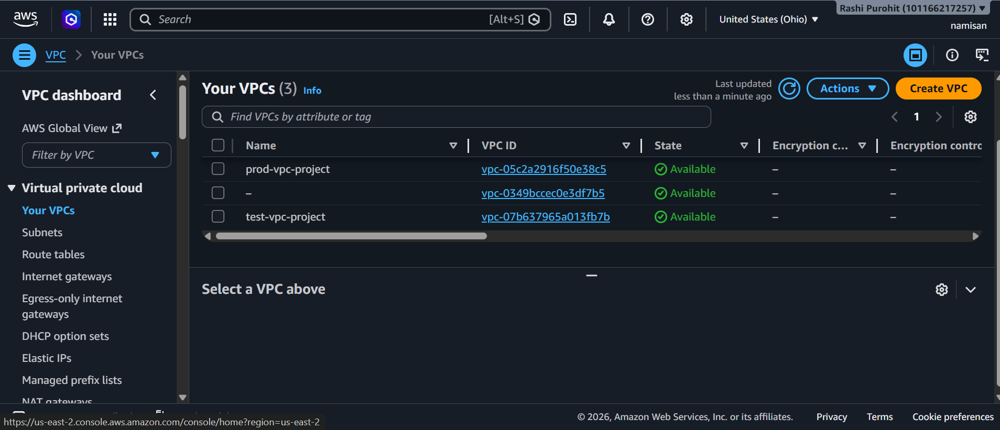
## 2 . Subnet Creation
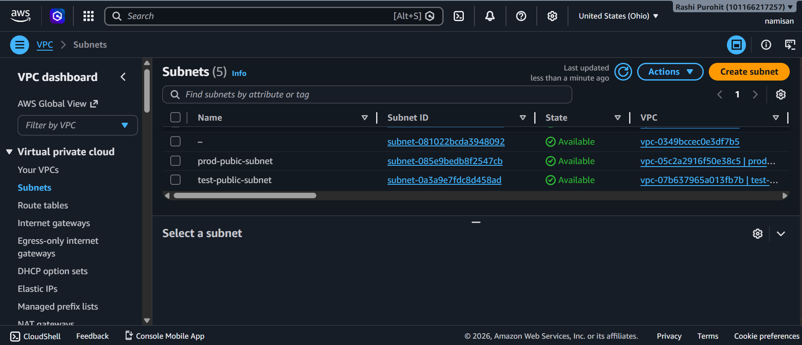
## 3 . Route Tables Configuration
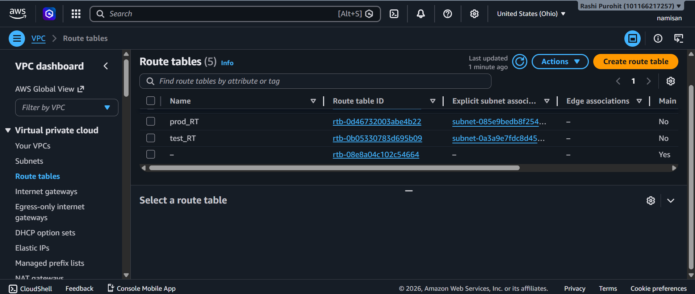
## 4. Internet Gateways Setup
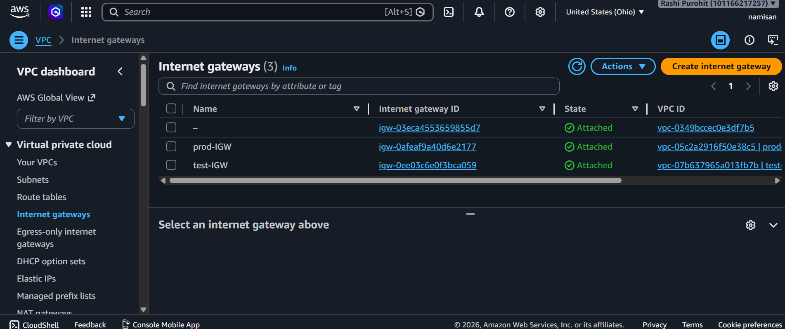
## 5. Peering Connection Active
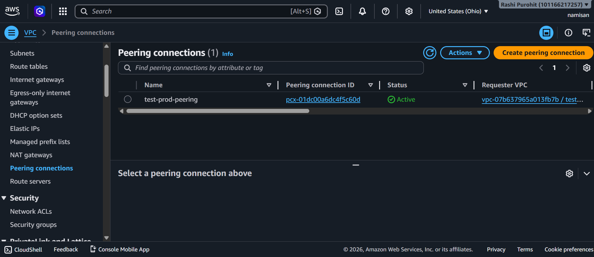
## 6. Test Route Table
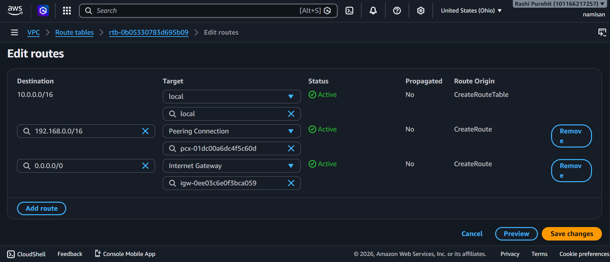
## 7. Prod Route Table
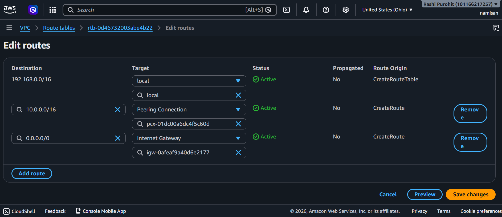
## 8. Test Security Group
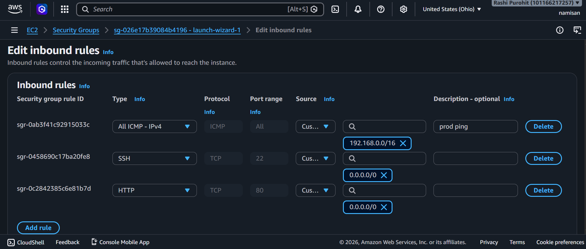
## 9. Prod Security Group
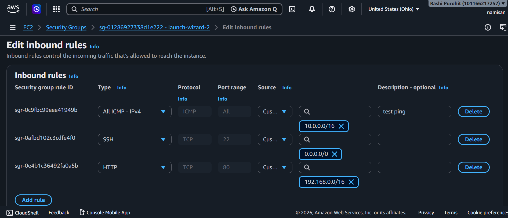
## 10. EC2 Instance
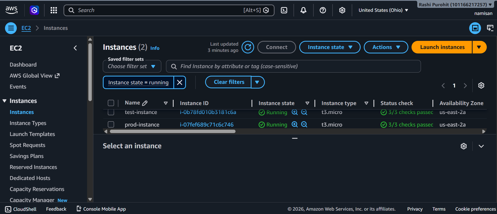
## 11. Ping test to prod
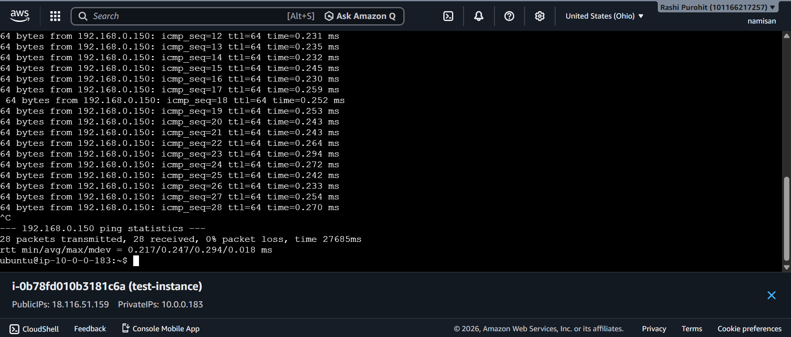
## 12 . ping prod to test
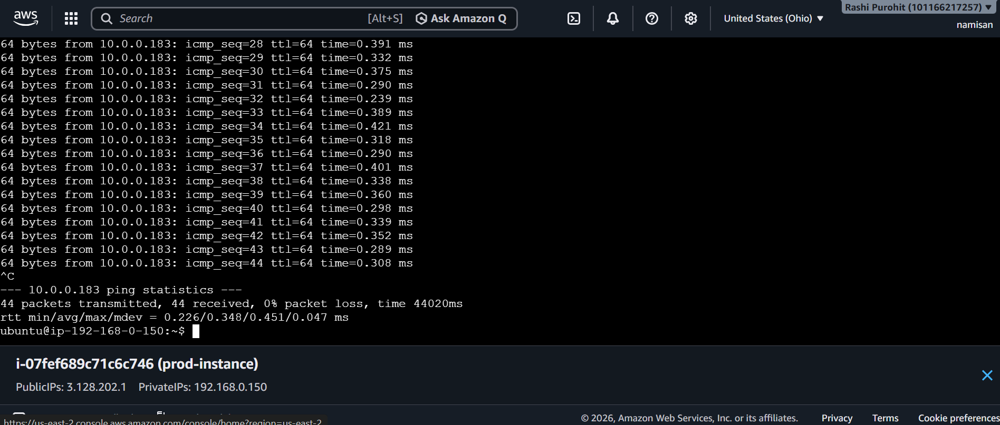
